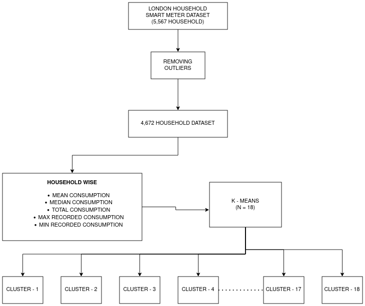
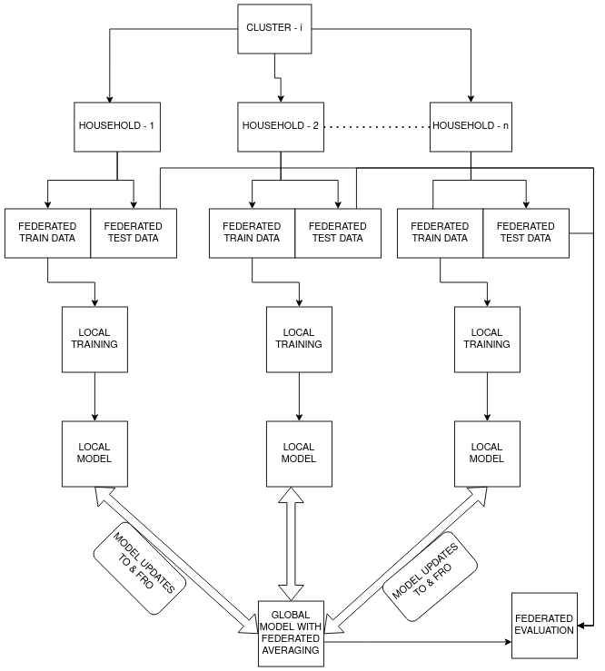
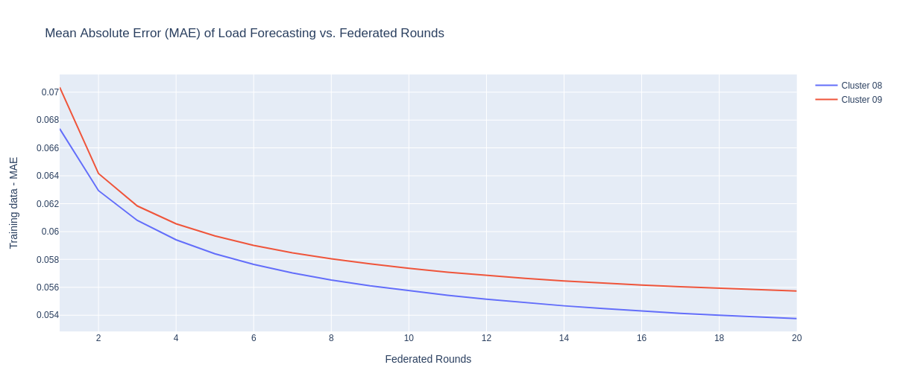
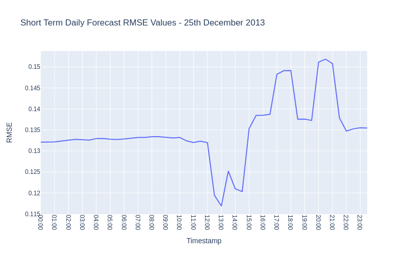

# Federated-Learning-Approach-towards-Smart-Energy-Meter-Dataset

This project is part of Msc Thesis at Trinity College Dublin. 

The project focuses on simulating a Federated Learning framework using the London Household smart energy meter dataset. The primary objective is to achieve comparable accuracy in load forecasting to state-of-the-art (SOTA) technologies while demonstrating the preservation
of data privacy through FL. In real-world scenarios, the challenge of non-i.i.d. connections persists. To replicate real-world conditions, limited random connections are considered for each round of FL. Additionally, since smart meters often have limited computational
power, small sequential dense neural networks (DNN) are utilized to address this constraint. These DNN models are well-suited for low computational power devices and contribute to solving the computational challenges posed by smart meters. Through
this project, the aim is to showcase the potential of FL in maintaining data privacy while achieving accurate load forecasting results, even in resource-constrained environments.

The simulation is performed using Tensorflow Federated Libraries and Framework. To install TFF refer https://www.tensorflow.org/federated/install

## The Methodology and Flow Diagrams used for this is below

## Cluster 08 Results
Training Loss Results (MAE vs Federated Rounds) 

## Code

The Code is divided into 5 parts
1) Data Cleaning and K - Means Application :
2) Custom TFF Algorithms for checking Global and Local Weights :
3) Short Term Daily Analysis code with custom loss function :
4) Weekly Analysis Code :
5) Monthly Analysis Code : 
   

